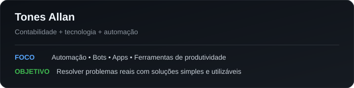
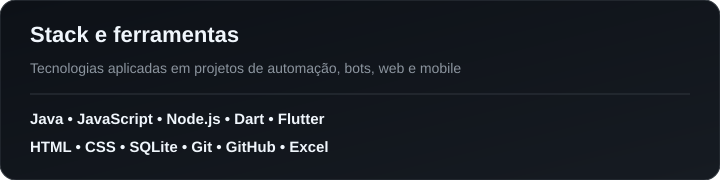

# Olá, eu sou Tones Allan 👋

### Ciências Contábeis • Departamento Pessoal • Automação • Desenvolvimento de Software

Transformo rotinas repetitivas e problemas do dia a dia em **ferramentas, bots e aplicações práticas**.

---

## 👨‍💻 Sobre mim

- 🎓 Estudante de **Ciências Contábeis**.
- 💼 Atuo com rotinas de **Departamento Pessoal**, folha, eSocial e processos trabalhistas.
- ⚙️ Desenvolvo soluções para **automatizar tarefas**, reduzir retrabalho e organizar processos.
- 🤖 Trabalho com bots, integrações, aplicações web, aplicativos mobile e ferramentas para produtividade.
- 🧩 Gosto de transformar uma necessidade real em uma solução simples, utilizável e evolutiva.

---

## 🛠️ Tecnologias e ferramentas

---

## 🚀 Projeto em destaque

### 🤝 [AmigoNPC](https://github.com/tonesallan/AmigoNPC-)

Mod server-side para **Hytale** que adiciona um NPC companheiro inteligente, persistente e configurável para cada jogador.

O projeto envolve:

- Java e arquitetura baseada em ECS;
- combate e comportamento de NPCs;
- persistência de dados;
- inventário, progressão e experiência;
- interfaces personalizadas;
- comandos e configurações server-side;
- desenvolvimento defensivo para acompanhar mudanças da API do jogo.

---

## 🔧 O que estou construindo

Além dos projetos públicos, mantenho projetos privados voltados a problemas reais do dia a dia, incluindo:

- 🤖 automação de divulgação e mensageria;
- 📊 ferramentas para rotinas de folha e Departamento Pessoal;
- 📱 aplicativos em Flutter;
- 🧾 automações de planilhas e processos administrativos;
- 🔌 integrações entre APIs, bancos de dados e serviços externos.

Meu foco é construir ferramentas que realmente sejam usadas, melhoradas continuamente e resolvam uma necessidade concreta.

---

## 📊 Perfil técnico

 

---

### 💡 Contabilidade + tecnologia + automação

**Menos trabalho repetitivo. Mais processo bem resolvido.**

